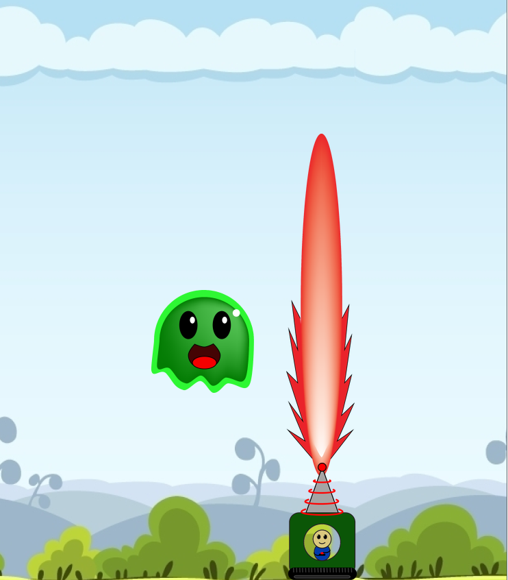

# Slime-Time
A colourful slime shooter game where slimes explode into smaller slimes when shot. Inspired by one of my favourite childhood games known as Bubble Trouble.

### Game Mechanics ###  
Move around with arrow keys and shoot with space.
Try to destroy all of the slimes, however the larger slimes will explode into smaller slimes when shot.

 

### Power Ups ###
There are 2 powerups that can be dropped in this game: laser and shield
The laser instantly vaporizes the slimes before they have a chance of splitting up.
The shield protects the player from one of the slimes attacks.

 
